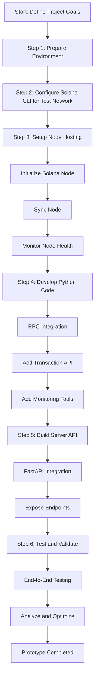

# oarc-solana

**A lightweight Python toolkit for Solana 🌞, enabling seamless blockchain interaction, hosting new Solana nodes through FastAPI, and managing nodes and test networks via a custom CLI, integrated into the Ollama Agent Roll Cage (OARC) framework.**

---

## Vision
*oarc-solana* bridges decentralized blockchain systems and user-centric tools. Its mission begins by establishing a test environment for Solana nodes, enabling developers to interact with the blockchain network, perform test transactions reliably, and manage nodes and networks efficiently using a CLI.

---

## Features

| **Feature Category**     | **Description**                                                                                 |
|---------------------------|-----------------------------------------------------------------------------------------------|
| **Server API Layer**      | - Powered by FastAPI for robust and scalable server operations.                                |
|                           | - Key endpoints to interact with hosted test nodes and blockchain functionalities.            |
| **Node Hosting Utilities**| - Tools to build, sync, and connect Solana nodes using Python.                                |
|                           | - Real-time swarm connectivity and health monitoring.                                         |
|                           | - RPC optimization for performance improvements.                                              |
| **Blockchain Interaction**| - Built atop `solana-py` for seamless integration.                                            |
|                           | - Modules for RPC tools, smart contract management, and wallet utilities.                     |
| **Developer Tools**       | - Secure data handling with encoding and decoding utilities.                                  |
|                           | - Pre-built tools for token distribution, NFT minting, and other use cases.                   |
| **Test Transactions**     | - End-to-end support for test wallet interactions and sending/receiving transactions.         |
| **Custom CLI API**        | - Command-line interface to manage servers, test nodes, and networks easily.                  |

---

## How to Set Up Test Nodes and Perform Test Transactions

### 1. **Prepare Your Environment**
#### Requirements:
- **System Specs**:
  - Minimum 8 GB RAM.
  - Multi-core processor.
  - 100 GB+ disk space for node data.
- **Dependencies**:
  - Python 3.8+
  - Installed Solana CLI tools (`solana install`).
  - Libraries:
    - `solana-py`
    - `FastAPI`
    - `uvicorn`

---

## Implementation

### Step-by-Step Action Plan to Implement this Project

#### 1. Define the Environment and Goals
- **Objective**: Host a lightweight Solana node on a test network and perform blockchain interactions via a Python-based API and CLI.
- Ensure all tools (Python, CLI libraries) and dependencies are installed.

#### 2. Configure Solana CLI for the Test Network
- Use the Solana CLI to set the configuration for the test network:
```bash
solana config set --url https://api.testnet.solana.com
```
- Test the configuration by verifying the connection:
```bash
solana cluster-version
```

#### 3. Create the Node Hosting Setup
- Develop functions using `oarc_solana.blockchain.rpc` to build and sync a node.
- Include node monitoring functionalities to ensure connectivity and health:
```python
from oarc_solana.blockchain.rpc import initialize_node, monitor_node

node = initialize_node(node_path="path/to/node", config="path/to/config")
node.sync()
status = monitor_node(node)
print(f"Node Health: {status}")
```

#### 4. Develop CLI Commands for Node and Test Network Management
- Use the `click` library to create a user-friendly CLI.
- Add commands to initialize nodes, sync nodes, monitor health, check wallet balances, and send transactions.
Example CLI usage:
```bash
oarc-cli init-node "path/to/node" "path/to/config"
oarc-cli sync-node
oarc-cli health
oarc-cli balance "TestWalletAddress"
oarc-cli transaction "PrivateKey" "RecipientAddress" 1.0
```

#### 5. Build and Test the API Layer
- Set up a FastAPI server to provide endpoints for core blockchain functionalities.
- Add functionality for:
  - Wallet operations: retrieving balances.
  - Transactions: securely sending tokens.
```python
from oarc_solana.server.api import initialize_api
from fastapi import FastAPI

app = FastAPI()
initialize_api(app)

if __name__ == "__main__":
    import uvicorn
    uvicorn.run(app, host="0.0.0.0", port=8000)
```

#### 6. Conduct End-to-End Testing
- Verify node functionality by performing basic test transactions.
- Use the CLI to interact with the test network and ensure stability and performance.
- Validate the FastAPI server’s responses.

#### 7. Document and Optimize
- Enhance the README with setup and usage instructions.
- Optimize code for node hosting and API performance.

---

### 4. **Host a Test Node**
#### Step 1: Build the Node
```python
from oarc_solana.blockchain.rpc import initialize_node

node = initialize_node(node_path="path/to/node", config="path/to/config")
print("Node initialized.")
```

#### Step 2: Sync the Node
```python
node.sync()
print("Node synchronization complete.")
```

#### Step 3: Monitor Node Health
```python
from oarc_solana.blockchain.rpc import monitor_node

status = monitor_node(node)
print(f"Node Health: {status}")
```

---

### 5. **Perform Test Transactions**

#### Retrieve Wallet Balance:
```python
from oarc_solana.blockchain.wallet import get_balance

balance = get_balance("TestWalletAddress")
print(f"Test Wallet Balance: {balance}")
```

#### Send Test Transactions:
```python
from oarc_solana.blockchain.transactions import send_transaction

tx_signature = send_transaction("TestPrivateKey", "RecipientTestAddress", 1.0)
print(f"Transaction Signature: {tx_signature}")
```

---

### 6. **Use the Custom CLI API**

#### Install CLI Dependencies:
Ensure the following libraries are installed:
```bash
pip install click
```

#### Example CLI Usage:
```bash
oarc-cli --help

Usage:
    oarc-cli [OPTIONS] COMMAND [ARGS]...

Commands:
    init-node   Initialize a new test node.
    sync-node   Sync the test node with the test network.
    health      Monitor the health of the node.
    balance     Fetch the balance of a wallet.
    transaction Send a test transaction.

Options:
    --version   Show the version of oarc-cli.
    --help      Show this message and exit.
```

---

## Project Structure
```plaintext
oarc_solana/
│
├── server/
│   ├── api.py             # FastAPI-based API tools
│
├── blockchain/
│   ├── rpc.py             # Node hosting utilities
│   ├── transactions.py    # Test transaction tools
│   ├── wallet.py          # Test wallet management
│
├── cli/
│   ├── cli.py             # Custom CLI API for managing nodes/networks
│
├── utils/
│   ├── encoding.py        # Data encoding utilities
│   ├── keys.py            # Key security tools
│
├── examples/
│   ├── test_transactions.py # Test transactions script
│   ├── node_health.py        # Node health monitoring demo
│
└── setup.py               # Package setup
```

---

## Roadmap
1. Refine CLI for enhanced server and node management functionality.
2. Develop additional CLI commands for extended test network operations.
3. Integrate metrics for real-time node and network monitoring.

---

## Contributing
Contributions are welcome! Fork the repository, submit pull requests, or share your ideas in the OARC community. Collaboration drives this project forward.

---

## License
Apache 2.0 License

## TODO


